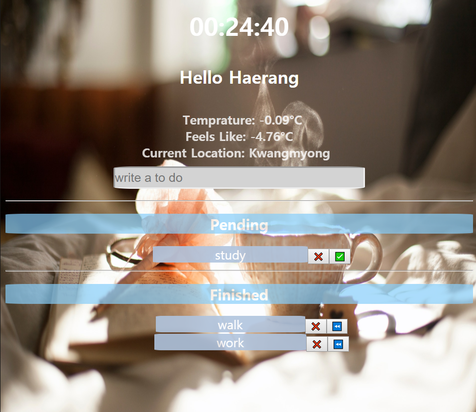

# CloneMomentum Project

```Momentum Project Webpage```
``` 크롬 앱 모멘텀 프로젝트 접속하기

기본 강좌 프로젝트에 여러 디자인과 기능을 추가해봤습니다. 
앞으로 공부하면서 계속해서 업데이트 시킬 예정입니다. 
It will be updated regularly.

```

https://haerang94.github.io/CloneMomentum-Project/




Learned from Nomad Coder
